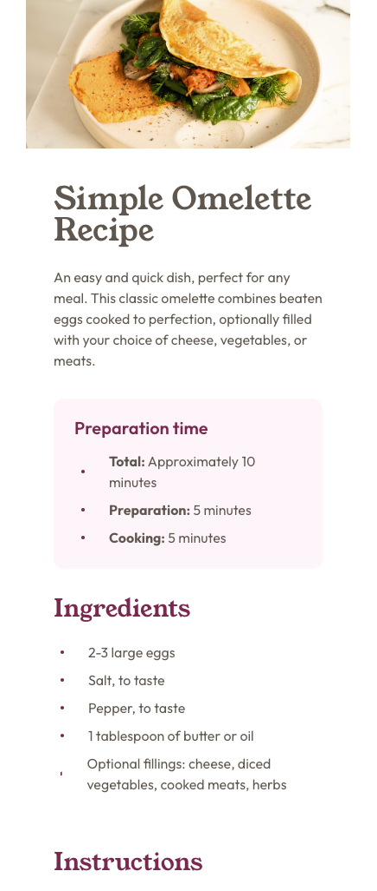
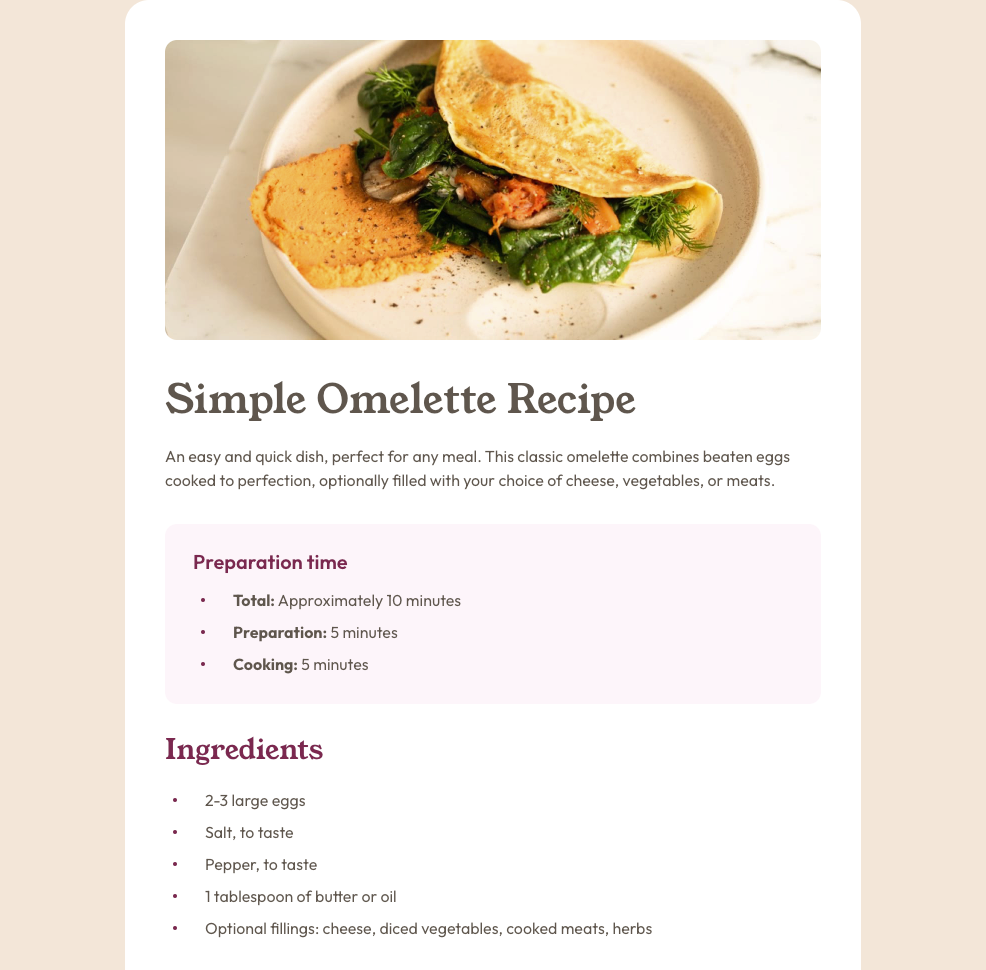

# Frontend Mentor - Recipe page solution

This is a solution to the [Recipe page challenge on Frontend Mentor](https://www.frontendmentor.io/challenges/recipe-page-KiTsR8QQKm). Frontend Mentor challenges help you improve your coding skills by building realistic projects. 

## Table of contents

- [Frontend Mentor - Recipe page solution](#frontend-mentor---recipe-page-solution)
  - [Table of contents](#table-of-contents)
  - [Overview](#overview)
    - [Screenshot](#screenshot)
    - [Links](#links)
    - [Built with](#built-with)
    - [What I learned](#what-i-learned)
    - [Continued development](#continued-development)

## Overview

It's a recipe page to make a simple omelette. It has an image, title, and a brief summary of the recipe. There are also some ingredients listed and directions to follow. And lastly, there is a nutrition table with the ingredients and their amounts.

### Screenshot
Mobile:

Desktop:

### Links

- Live Site URL: [https://py-code314.github.io/recipe-page/](https://py-code314.github.io/recipe-page/)

### Built with

- Semantic HTML5 markup
- CSS custom properties
- Flexbox
- Mobile-first workflow

### What I learned

I had some issues with styling the nutrition table. I had to do some research and learned that table row doesn't support `padding` property. I had to do some trial and error to apply styles to the table.

### Continued development

I want to learn more about styling the table and how to make it responsive.

